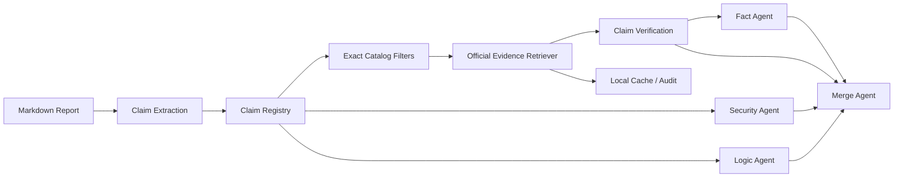

# Agent Network v0.4 Claim Verification Design Freeze

## 1. 定位与架构差异

v0.3 是 Official Evidence Foundation：它负责目录、官方文档抓取、清洗、确定性 Chunk、BM25 检索、缓存，以及向 Fact Agent 提供受限证据。v0.4 在其上增加 Claim Verification 语义层，将报告中的可核验陈述建模为一等对象，并把“检索到相关内容”与“证据支持该陈述”明确分开。

v0.4 不改变 v0.3 的四 Agent workflow、默认配置、Provider 安全边界或调用次数。Claim Verification 优先作为可选、可审计的 Fact 能力；Security、Logic、Merge 通过兼容字段消费结果，而不是各自重新实现验证逻辑。

## 2. Claim 对象模型

Claim 是从报告中提取的、可独立判断的陈述。建议字段：

```json
{
  "claim_id": "claim-001",
  "text": "Cluster Agent establishes a connection to Rancher Server.",
  "normalized_text": "cluster agent establishes connection rancher server",
  "source_location": "section 2, paragraph 3",
  "product": "Rancher Manager",
  "component": "Cluster Agent",
  "claim_type": "architecture",
  "priority": "high",
  "extraction_confidence": 0.91,
  "verification_status": "unverified",
  "evidence_ids": [],
  "limitations": []
}
```

`claim_id` 必须稳定生成或由上游提供。原文 `text` 是审计依据，`normalized_text` 只用于检索，不能替代原文。对象不得包含 Secret、Token 或完整私有凭据。

## 3. Claim 分类体系

分类是有限枚举，首期包括：

- `architecture`: 组件、通信关系和数据流
- `configuration`: 配置、默认值和启用条件
- `authorization`: ServiceAccount、RBAC、Role 和权限
- `security_control`: TLS、认证、隔离和安全控制
- `version_support`: 版本、兼容性和补丁边界
- `behavior`: 运行时行为、故障和生命周期
- `quantitative`: 数字、阈值和性能断言
- `citation_or_provenance`: 来源、公告和引用关系
- `other`: 无法可靠归类的陈述

分类错误不能直接改变验证结论；必须保留分类置信度和人工可复核路径。

## 4. Claim Extraction Pipeline

```text
Markdown report
  -> structural segmentation
  -> claim-like sentence detection
  -> deterministic normalization
  -> optional Fact-model extraction
  -> schema validation
  -> claim de-duplication
  -> Claim Registry
```

Extraction 先使用标题、段落、列表、代码和引用位置等结构信息。模型只能在显式启用时辅助拆分或分类，不得凭空补充事实。每个 Claim 必须保留原文位置、来源片段、提取方式和审计状态。失败 Claim 进入 `extraction_failed`，不伪造验证结果。

## 5. Claim Verification Pipeline

```text
Claim
  -> exact filters from Claim metadata
  -> Official Evidence Retriever
  -> candidate Evidence chunks
  -> relation assessment
  -> contradiction / support checks
  -> VerificationResult
  -> Fact review and report rendering
```

Retriever 仍复用 v0.3 Catalog、local cache、Chunk 和 BM25。验证层不能把 BM25 score 当作事实证明；它必须检查证据是否明确表达 Claim、是否表达相反事实、是否只有间接关联，或是否没有提供支持。时效性事实必须保留 `needs_external_verification` 或等价局限。

## 6. Evidence 与 Claim 关系

Claim 与 Evidence 是多对多关系，但每条关系都要可追溯：

```text
claim_id -> evidence_id -> chunk_id -> document_id -> canonical_url
```

关系使用有限枚举：

- `direct_support`: Evidence 明确表达 Claim
- `direct_contradiction`: Evidence 明确表达相反事实
- `absence_of_support`: 提供材料没有表达该 Claim，不等于反驳
- `indirect_evidence`: 相关但不足以直接建立 Claim
- `unavailable`: 没有可用或可信 Evidence

关系必须附带 `evidence_limitations`。没有已验证 chunk 引用时，不能标记 `direct_support` 或 `direct_contradiction`。

## 7. 四 Agent 接入方式

- Fact：首个消费者。接收 Claim、受限 Top-K Evidence、关系、引用校验结果和检索局限，负责事实判断但不得越过证据边界。
- Security：继续审查安全风险；v0.4 可读取经验证的 Claim 状态作为上下文，但不重新抓取或重新排序证据。
- Logic：使用 Claim 之间的依赖、冲突和推理链检查论证是否成立。
- Merge：合并各 Agent 结论与 VerificationResult，保留 supporting、dissenting、原始严重度和决策理由。

四个 Agent 仍是现有四个，标准完整 workflow 的业务模型调用约束不变。Verification 作为本地能力或 Fact 上下文阶段接入，不新增 Reviewer Agent。

## 8. Verification Status

建议状态：

- `verified_supported`: 有直接官方证据支持
- `verified_contradicted`: 有直接官方证据反驳
- `insufficient_evidence`: 有相关材料但不足以判断
- `not_mentioned`: 材料未提及该 Claim
- `unavailable`: 来源、缓存或处理失败
- `needs_external_verification`: 需要核验当前版本、公告、CVE 或补丁事实
- `extraction_failed`: Claim 本身无法可靠建立

状态与 `severity` 分离。状态不自动决定风险等级，风险等级仍由现有审查流程判断。

## 9. 数据流图



## 10. 分阶段计划

### v0.4.0: Design And Offline Contract

- 冻结 Claim、Evidence Link、VerificationResult schema
- 完成离线 Claim fixture、关系规则和状态机
- 增加确定性 Claim Registry 与审计字段
- 使用 stub Retriever/LLM 建立 Fact 接入回归测试
- 保证 v0.3 默认行为和四调用约束不变

### v0.4.1: Controlled Verification MVP

- 接入现有 local_cache Provider
- 支持按 Claim 元数据的精确过滤
- 生成支持、反驳、不足和不可用结果
- 增加时效性事实与外部核验标记
- 增加人工复核输出和离线基准

### v0.4.2: Workflow Observability

- 在 run registry 中记录 Claim 数量、状态分布、证据覆盖率和失败原因
- 将验证摘要以兼容字段提供给 Security、Logic、Merge
- 增加 disagreement、citation error 和未验证 Claim 的回归报告
- 评估是否需要后续人工确认点，但不默认改变 workflow

## 11. 明确不实现范围

v0.4 设计冻结不包含：自动全网搜索、非官方来源默认信任、向量数据库、Embedding、LLM rerank、自动 Claim 事实补全、第二个 Fact Agent、Security/Logic/Merge 专用验证 Agent、自动修正文档、无人工监督的最终安全结论、真实模型大规模准确率保证，以及绕过官方域名、缓存和引用校验的快捷路径。
